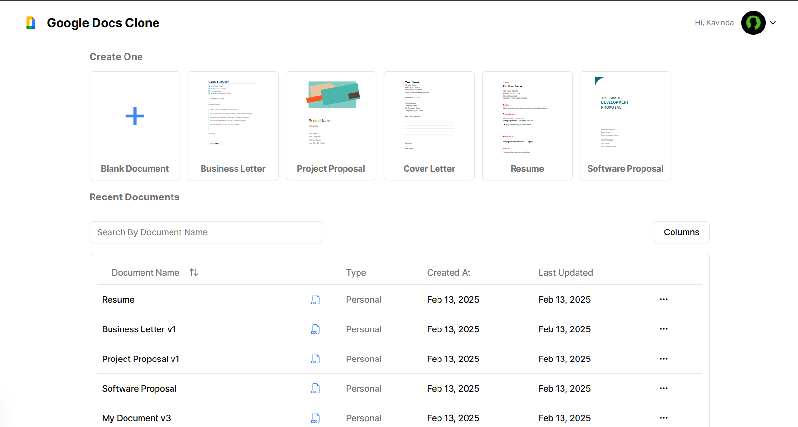
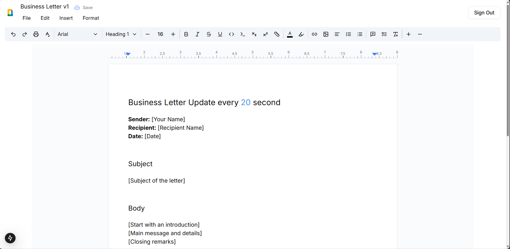

# Google Docs Clone V1.0

## Used Technologies

- [Next.js](https://nextjs.org)
- [Better Auth](https://betterauth.dev)
- [Prisma](https://prisma.io)
- [Tailwind CSS](https://tailwindcss.com)
- [Postgres DB](https://www.postgresql.org)

## functionalities
- [x] Table showcasing the files
- [x] various Document Templates
- [x] Full Text Editor with various functionalities
  - [x] Bold, Italic, Underline, Strike through, Highlight, Code, Link, Image, Table, Code Block, Blockquote, Heading, List, Numbered List, Indent, Outdent, Align, Undo, Redo, Clear Formatting, Full Screen, Print, Save, Download, Delete, Update
  - [x] Save document
  - [x] Download document
  - [x] Insert Image
- [x] Document download
- [x] Document delete
- [x] Document update
- [x] Document search
- [x] Document sort
- [x] Document pagination

# upcoming features

## Google Docs Clone V1.1

### functionalities
- [x] save the uploaded image in the server
- [x] insert the uploaded image in the document
- [x] delete the uploaded image from the server
- [x] delete the uploaded image from the document
- [x] update the uploaded image in the document
- [x] live collaboration

## Preview

